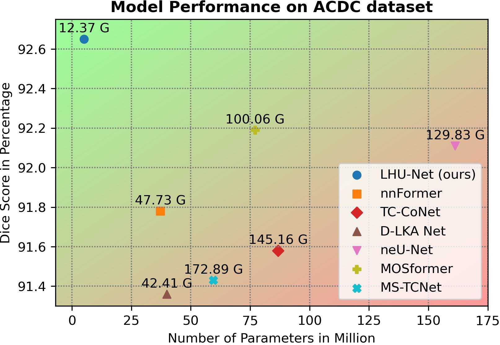
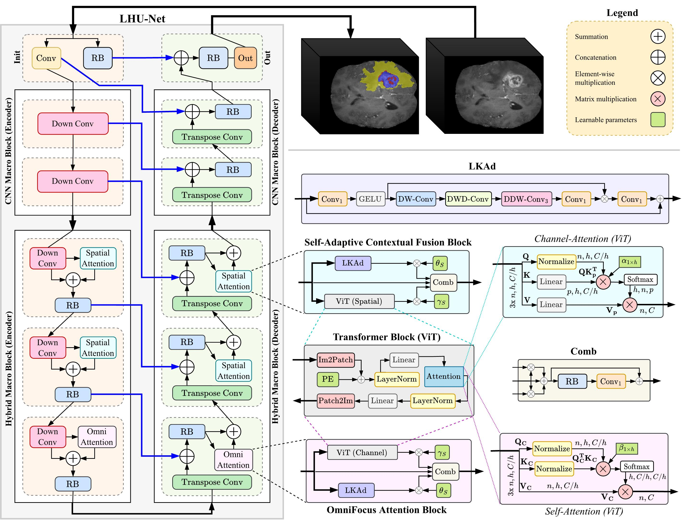
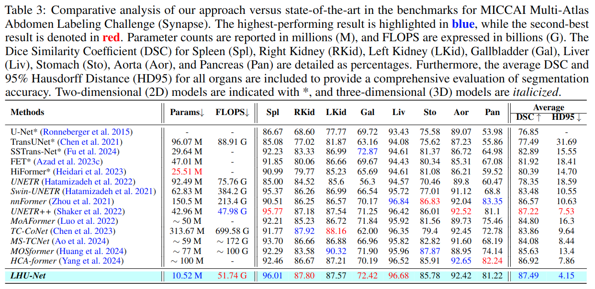
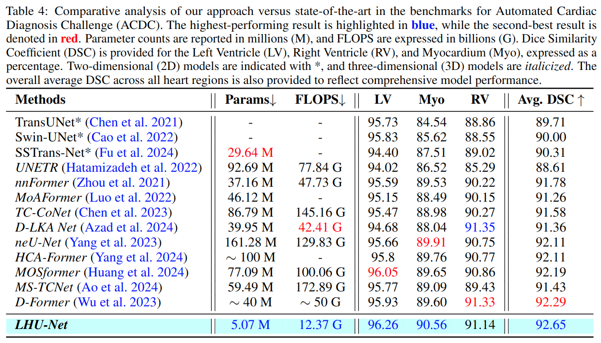

# LHU-Net: A Light Hybrid U-Net for Cost-Efficient High-Performance Volumetric Medical Image Segmentation

[](https://arxiv.org/abs/2309.00121)

This repository contains the official implementation of **LHU-Net**. Our paper, "LHU-Net: A Light Hybrid U-Net for Cost-Efficient High-Performance Volumetric Medical Image Segmentation," addresses the growing complexity in medical image segmentation models, focusing on balancing computational efficiency with segmentation accuracy.

> Yousef Sadegheih, Afshin Bozorgpour, Pratibha Kumari, Reza Azad, and Dorit Merhof

## Abstract

> As a result of the rise of Transformer architectures in medical image analysis, specifically in the domain of medical image segmentation, a multitude of hybrid models have been created that merge the advantages of Convolutional Neural Networks (CNNs) and Transformers. These hybrid models have achieved notable success by significantly improving segmentation accuracy. Yet, this progress often comes at the cost of increased model complexity, both in terms of parameters and computational demand. Moreover, many of these models fail to consider the crucial interplay between spatial and channel features, which could further refine and improve segmentation outcomes. To address this, we introduce \textbf{LHU-Net}, a Light Hybrid U-Net architecture optimized for volumetric medical image segmentation. LHU-Net is meticulously designed to prioritize spatial feature analysis in its initial layers before shifting focus to channel-based features in its deeper layers, ensuring a comprehensive feature extraction process. Rigorous evaluation across five benchmark datasets — Synapse, LA, Pancreas, ACDC, and BRaTS 2018 — underscores LHU-Net's superior performance, showcasing its dual capacity for efficiency and accuracy. Notably, LHU-Net sets new performance benchmarks, such as attaining a Dice score of 92.65 on the ACDC dataset, while simultaneously reducing parameters by $85\%$ and quartering the computational load compared to existing state-of-the-art models. Achieved without any reliance on pre-training, additional data, or model ensemble, LHU-Net's effectiveness is further evidenced by its state-of-the-art performance across all evaluated datasets, utilizing fewer than 11 million parameters. This achievement highlights that balancing computational efficiency with high accuracy in medical image segmentation is feasible. 

## Key Contributions

- **Efficient Hybrid Attention Selection**: Introduces a strategic deployment of specialized attention mechanisms within Transformers, enabling nuanced feature extraction tailored to the demands of medical image segmentation.
- **Benchmark Setting Efficiency**: Achieves high-performance segmentation with significantly reduced computational resources, demonstrating an optimal balance between model complexity and computational efficiency.
- **Versatile Superiority**: Showcases unparalleled versatility and state-of-the-art performance across multiple datasets, highlighting its robustness and potential as a universal solution for medical image segmentation.

<p align="center">
  
</p>
<!--  -->

## Model Architecture

LHU-Net leverages a hierarchical U-Net encoder-decoder structure optimized for 3D medical image segmentation. The architecture integrates convolutional-based blocks with hybrid attention mechanisms, capturing both local features and non-local dependencies effectively.

<p align="center">
  
</p>
<!--  -->

*For a detailed explanation of each component, please refer to our paper.*

## Datasets

Our experiments were conducted on five benchmark datasets:
- **Synapse**
- **ACDC**
- **LA**
- **NIH Pancreas dataset (CT-82)**
- **BraTS Challenge 2018**

LHU-Net demonstrated exceptional performance across these datasets, significantly outperforming existing state-of-the-art models in terms of efficiency and accuracy.

## Results
<p align="center">
  
</p>

<p align="center">
  
</p>
<!-- 
 -->

## Getting Started

This section provides instructions on how to run LHU-Net for your segmentation tasks.

### Requirements
  - Ubuntu 16.04 or higher
  - CUDA 12.x
  - Python v3.7 or higher
  - Pytorch v2.x
  - Pytorch-lightning 2.x
  - Hardware Spec
    - GPU with 8GB memory or larger capacity
    - _For our experiments, we used 1GPU(A100-80G)_

Install the required packages:

```bash
pip install -r requirements.txt
```

Install 3D deformable convolutions:
  ```bash
  cd dcn/
  pip install .
  ```

### Training, Inference, Pre-trained weights, and Visulizations

Instructions on how to train LHU-Net and perform infernece on your dataset.

For detailed instructions for Synapse and ACDC datasets, please refer to the [README](Synapse_ACDC/README.md).

For detailed instructions for BraTS 2018, LA, and Pancreas datasets, please refer to the [README](BRATS_LA_Pancreas/README.md).


## Acknowledgments

This repository is built based on [nnFormer](https://github.com/282857341/nnFormer), [nnU-Net](https://github.com/MIC-DKFZ/nnUNet), [UNETR++](https://github.com/Amshaker/unetr_plus_plus), [MCF](https://github.com/WYC-321/MCF), [D3D](https://github.com/XinyiYing/D3Dnet/tree/master), [D-LKA](https://github.com/xmindflow/deformableLKA). We thank the authors for their code repositories.

## Citation

If you find this work useful for your research, please cite:

```bibtex
@article{sadegheih2024lhunet,
  title={LHU-Net: A Light Hybrid U-Net for Cost-Efficient High-Performance Volumetric Medical Image Segmentation},
  author={Sadegheih, Yousef and Bozorgpour, Afshin and Kumari, Pratibha and Azad, Reza and Merhof, Dorit},
  year={2024}
}
```
