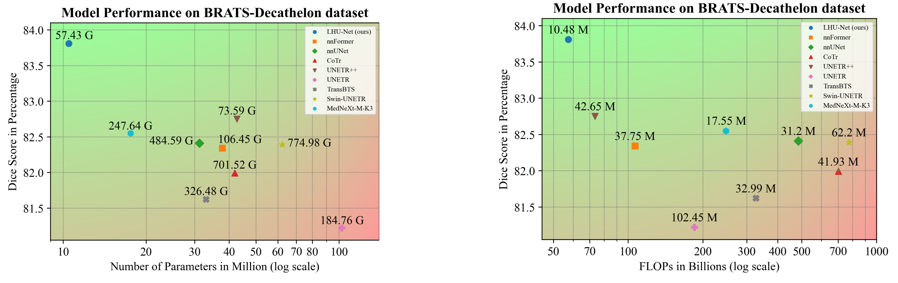
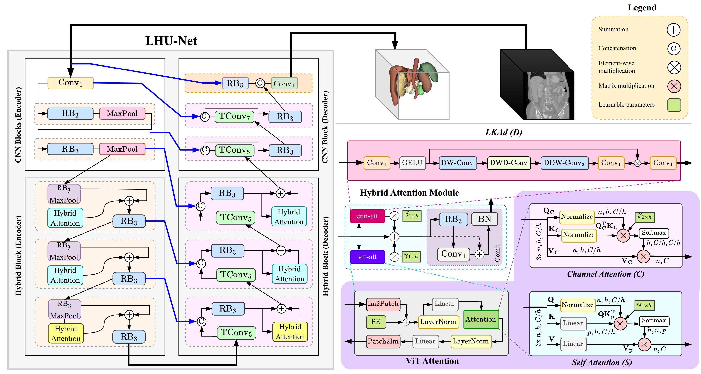
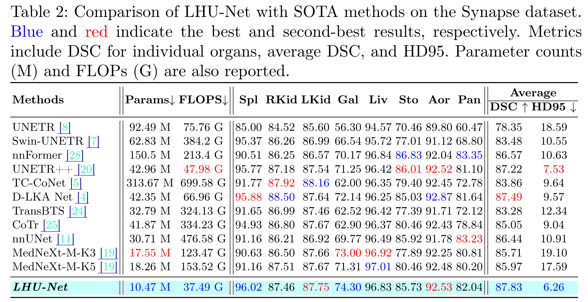
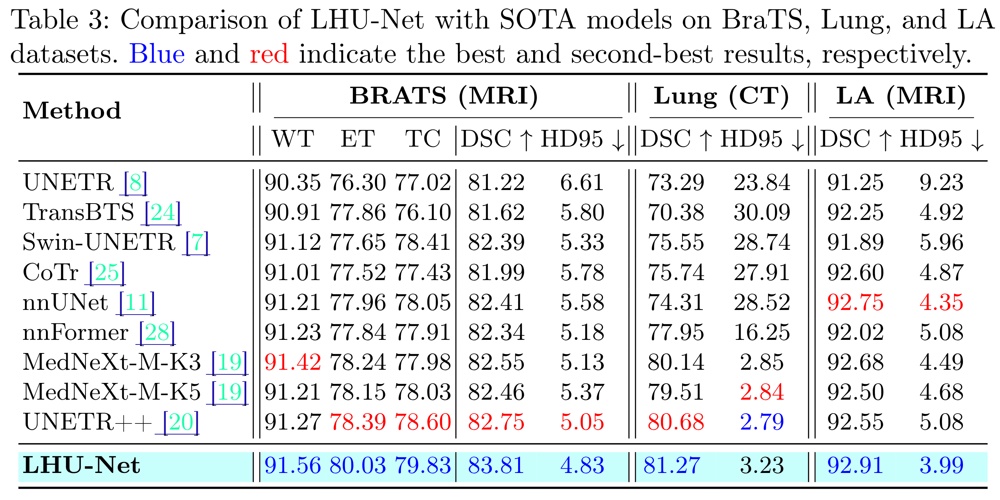
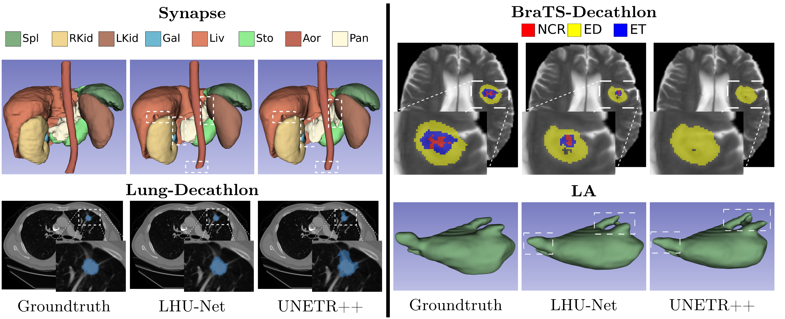

# LHU-Net: A Lean Hybrid U-Net for Cost-Efficient High-Performance Volumetric Medical Image Segmentation

[](https://arxiv.org/abs/2404.05102)

This repository contains the official implementation of **LHU-Net**. Our paper, *"LHU-Net: A Lean Hybrid U-Net for Cost-Efficient High-Performance Volumetric Medical Image Segmentation,"* addresses the growing complexity in medical image segmentation models, focusing on balancing computational efficiency with segmentation accuracy.

> Yousef Sadegheih, Afshin Bozorgpour, Pratibha Kumari, Reza Azad, and Dorit Merhof

---

## 📑 Table of Contents

1. [Abstract](#-abstract)
2. [Updates](#bell-updates)
3. [Key Contributions](#zap-key-contributions)
4. [Model Architecture](#gear-model-architecture)
5. [Datasets, Pre-trained Weights, and Visualizations](#%EF%B8%8F-datasets-pre-trained-weights-and-visualizations)
6. [Results](#-results)
7. [Getting Started](#-getting-started)
    - [Requirements](#%EF%B8%8F-requirements)
    - [Installation](#-installation)
    - [Training & Inference](#%EF%B8%8F-training--inference)
    - [Notes](#%EF%B8%8F-notes)
8. [Acknowledgments](#-acknowledgments)
9. [Citation](#books-citation)
10. [Touchstone Benchmark](#touchstone-benchmark)

---


## 📝 Abstract

The rise of Transformer architectures has advanced medical image segmentation, leading to hybrid models that combine Convolutional Neural Networks (CNNs) and Transformers. However, these models often suffer from excessive complexity and fail to effectively integrate spatial and channel features, crucial for precise segmentation. To address this, we propose LHU-Net, a Lean Hybrid U-Net for volumetric medical image segmentation. LHU-Net prioritizes spatial feature extraction before refining channel features, optimizing both efficiency and accuracy. Evaluated on four benchmark datasets (Synapse, Left Atrial, BraTS-Decathlon, and Lung-Decathlon), LHU-Net consistently outperforms existing models across diverse modalities (CT/MRI) and output configurations. It achieves state-of-the-art Dice scores while using four times fewer parameters and 20% fewer FLOPs than competing models, without the need for pre-training, additional data, or model ensembles. With an average of 11 million parameters, LHU-Net sets a new benchmark for computational efficiency and segmentation accuracy. 

---

## :bell: Updates
- :muscle: **[Touchstone Benchmark](https://github.com/MrGiovanni/Touchstone?tab=readme-ov-file#touchstone-10-model)** code and weight release - *January 30, 2026*
- :punch: **Complete rewrite of the source code** for full compatibility with the nnUNetV2 framework – *July 29, 2025*
- 🥳: **Paper Accepted in MICCAI 2025** – *June 17, 2025*
- :fire: Participation in **[Touchstone Benchmark](https://github.com/MrGiovanni/Touchstone?tab=readme-ov-file#touchstone-10-model)** – *July 16, 2024*
- :sunglasses: **First release** – *April 5, 2024*

---

## :zap: Key Contributions

- **Efficient Hybrid Attention Selection**: Introduces a strategic deployment of specialized attention mechanisms within Transformers, enabling nuanced feature extraction tailored to the demands of medical image segmentation.
- **Benchmark Setting Efficiency**: Achieves high-performance segmentation with significantly reduced computational resources, demonstrating an optimal balance between model complexity and computational efficiency.
- **Versatile Superiority**: Showcases unparalleled versatility and state-of-the-art performance across multiple datasets, highlighting its robustness and potential as a universal solution for medical image segmentation.

<p align="center">
  
</p>

---

## :gear: Model Architecture

LHU-Net leverages a hierarchical U-Net encoder-decoder structure optimized for 3D medical image segmentation. The architecture integrates convolutional-based blocks with hybrid attention mechanisms, capturing both local features and non-local dependencies effectively.

<p align="center">
  
</p>

*For a detailed explanation of each component, please refer to our paper.*

---

## 🗄️ Datasets, Pre-trained weights, and Visualizations

Our experiments were conducted on four benchmark datasets. The pre-processed datasets and pre-trained weights, including the predicted outputs on the test splits, can be downloaded from the table below.

| **Dataset** | **Visualization** | **Pre-Trained Weights** | **Pre-Processed Dataset** |
|-------------|------------------|-------------------------|---------------------------|
   [BRaTS-Decathlon](http://medicaldecathlon.com/)  | [[Download Visualization](https://myfiles.uni-regensburg.de/filr/public-link/file-download/044787a097ab1daf0197ac866ffd03d7/137194/549681019582853268/brats_vis.zip)]| [[Download Weights](https://myfiles.uni-regensburg.de/filr/public-link/file-download/0447879f97ab1d8f01985540b3697f9d/139872/8834379024962208660/Dataset703_BraTSDecathelon.zip)] | [[Download Dataset](https://myfiles.uni-regensburg.de/filr/public-link/file-preview/0447879f97ab1d8f019850ec84127740/139843/8988911091315547724)] 
   [Left Atrial (LA)](https://www.cardiacatlas.org/atriaseg2018-challenge/)     | [[Download Visualization](https://myfiles.uni-regensburg.de/filr/public-link/file-download/044787a097ab1daf0197ac8670a303db/137195/7579435805778831684/LA_vis.zip)]| [[Download Weights (fold 0)](https://myfiles.uni-regensburg.de/filr/public-link/file-download/0447879f97ab1d8f01985541075b7fa1/139874/5942682231994731673/Dataset708_LAPreProcessed.zip)] | [[Download Dataset](https://myfiles.uni-regensburg.de/filr/public-link/file-download/044787a097ab1daf0197ac87fec103ec/137188/-853117849856220300/LA_Dataset.zip.001)]
   [Lung-Decathlon](http://medicaldecathlon.com/)      | [[Download Visualization](https://myfiles.uni-regensburg.de/filr/public-link/file-download/044787a097ab1daf0197acb94b250685/137196/-3165844358820756419/Lung.zip)]| [[Download Weights](https://myfiles.uni-regensburg.de/filr/public-link/file-download/0447879f97ab1d8f019855416f8a7fa9/139875/-8720012220474206476/Dataset709_Lung.zip)] | [[Download Dataset](https://myfiles.uni-regensburg.de/filr/public-link/file-preview/0447879f97ab1d8f019850edc0897746/139844/-7063925517113994682)]
   [Synapse](https://www.synapse.org/Synapse:syn3193805/wiki/89480)  | [[Download Visualization](https://myfiles.uni-regensburg.de/filr/public-link/file-download/044787a097ab1daf0197ac8671ed03e3/137197/1243835443655735172/Synapse_vis.zip)]| [[Download Weights](https://myfiles.uni-regensburg.de/filr/public-link/file-download/0447879f97ab1d8f01985541a2e47fad/139876/-3482765111808873404/Dataset700_Synapse.zip)] | [[Download Dataset](https://myfiles.uni-regensburg.de/filr/public-link/file-download/044787a097ab1daf0197acacd3340529/137193/35684058196016065/Synapse_Dataset.zip.001)]

### Notes:
- The dataset splits used in our experiments can be found in the `splits_final.json` file within each pre-processed dataset folder.


## 📈 Results
LHU-Net demonstrated exceptional performance across these datasets, significantly outperforming existing state-of-the-art models in terms of efficiency and accuracy.
<p align="center">
  
</p>

<p align="center">
  
</p>
<p align="center">
  
</p>
<!-- 
 -->

## 🚀 Getting Started

This section provides instructions on how to run **LHU-Net** for your segmentation tasks. It is built using **nnUNetV2** as its framework.

### 🛠️ Requirements

- **Operating System**: Ubuntu 22.04 or higher
- **CUDA**: Version 12.x
- **Package Manager**: Conda
- **Hardware**:
  - GPU with **8GB** memory or larger (recommended)
  - _For our experiments, we used a single GPU (A100-80G)_

### 📦 Installation

To install the required packages and set up the environment, simply run the following command:

```bash
./env_creation.sh
```

This will:

- Create a Conda environment named `lhunet`
- Install all the necessary dependencies
- Automatically move the essential files from the `src` folder to the `nnUNetV2` directory

### 🏋️ Training & Inference

For training and inference, you can use the provided shell scripts located in the `script` folder. These scripts are pre-configured for easy execution.

### ⚠️ Notes

- **Path Configuration**: Before running the scripts, make sure to update the paths in the shell script files to reflect your setup.
- **Metrics**: There is a `metrics` folder containing Python scripts that can be used to calculate **DSC (Dice Similarity Coefficient)** and **HD95 (Hausdorff Distance 95%)** metrics for each dataset.

## 🤝 Acknowledgments

This repository is built based on [nnFormer](https://github.com/282857341/nnFormer), [nnU-Net](https://github.com/MIC-DKFZ/nnUNet), [UNETR++](https://github.com/Amshaker/unetr_plus_plus), [MCF](https://github.com/WYC-321/MCF), [D3D](https://github.com/XinyiYing/D3Dnet/tree/master), [D-LKA](https://github.com/xmindflow/deformableLKA). We thank the authors for their code repositories.

## :books: Citation

If you find this work useful for your research, please cite:

```bibtex
@inproceedings{sadegheih2025lhu,
  title={LHU-Net: A lean hybrid u-net for cost-efficient, high-performance volumetric segmentation},
  author={Sadegheih, Yousef and Bozorgpour, Afshin and Kumari, Pratibha and Azad, Reza and Merhof, Dorit},
  booktitle={International Conference on Medical Image Computing and Computer-Assisted Intervention},
  pages={326--336},
  year={2025},
  organization={Springer}
}
```

## [Touchstone Benchmark](https://github.com/MrGiovanni/Touchstone?tab=readme-ov-file#touchstone-10-model)

For the implementation and weights for the touchstone benchmark, please visit [here](AbdomenAtlas1.0/README.md).
